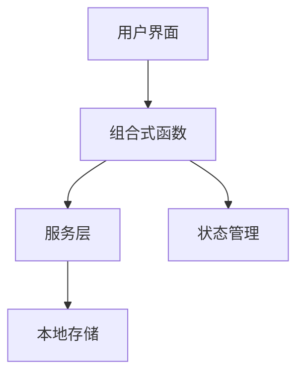

# 智能日志分析工具

一个基于 Vue 3 + TypeScript 的智能日志分析工具，能够自动解析日志文件、定义分析规则，并基于规则对日志进行智能分析和流程检测。

## 🌟 功能特性

### 📋 日志查看
- **文件夹加载**：选择包含日志文件的文件夹，自动解析所有文本文件
- **智能解析**：自动识别日志级别、时间戳、包名、别名、标签等信息
- **高级筛选**：
  - 关键词搜索（支持正则表达式）
  - 按包名、别名、标签筛选
  - 按日志级别（DEBUG、INFO、WARN、ERROR）筛选
- **实时统计**：显示文件数量、日志条目数、级别分布等统计信息
- **时间排序**：自动按时间顺序排列日志条目

### ⚙️ 规则管理
- **可视化编辑**：通过直观的界面创建和编辑分析规则
- **规则组成**：
  - 过程规则：按顺序定义流程中的各个步骤
  - 成功模式：定义流程成功的标志
  - 失败模式：定义流程失败的标志
- **导入导出**：支持规则的 JSON 格式导入导出
- **持久化存储**：规则自动保存到浏览器本地存储
- **示例规则**：内置多个实用的示例规则模板

### 🔍 规则分析
- **多规则选择**：可选择单个或多个规则进行分析
- **智能流程检测**：自动识别日志中的多个流程实例
- **时间顺序分析**：严格按照日志时间顺序进行分析
- **流程中断检测**：能够识别流程在哪个环节中断
- **置信度评估**：根据匹配情况评估分析结果的可靠程度
- **详细报告**：提供每个步骤的匹配状态、时间范围和推断依据

## 🚀 快速开始

### 环境要求
- Node.js 16+
- npm 或 yarn

### 安装依赖
```bash
npm install
```

### 开发模式
```bash
npm run dev
```

### 构建生产版本
```bash
npm run build
```

## 📖 使用指南

### 1. 加载日志文件
1. 进入"日志查看"页面
2. 点击"选择日志文件夹"按钮
3. 选择包含日志文件的文件夹
4. 系统自动解析并显示所有日志条目

### 2. 创建分析规则
1. 进入"规则管理"页面
2. 点击"创建规则"按钮
3. 填写规则基本信息：
   - 规则名称
   - 规则描述
4. 定义过程规则：
   - 按顺序添加流程步骤
   - 每个步骤包含名称和匹配模式
5. 设置成功/失败模式：
   - 定义表示成功的关键词
   - 定义表示失败的关键词
6. 保存规则

### 3. 分析日志
1. 进入"规则分析"页面
2. 从规则列表中选择要分析的规则
3. 点击"开始分析"按钮
4. 查看分析结果：
   - 每个规则实例的状态（成功/失败/推测）
   - 每个步骤的匹配情况
   - 流程时间范围
   - 中断位置（如果有）

## 🏗 技术架构

### 前端框架
- **Vue 3** - 渐进式 JavaScript 框架
- **TypeScript** - 类型安全的 JavaScript 超集
- **Composition API** - 逻辑复用和代码组织

### 核心模块
```
src
 ┣ assets                         # 静态资源目录（图片、样式、字体等）
 ┣ components                     # 可复用组件目录
 ┃ ┣ container                    # 布局容器组件
 ┃ ┃ ┣ GlobalTips.vue             # 全局提示组件（显示系统级提示信息）
 ┃ ┃ ┣ Header.vue                 # 页面头部组件（导航栏、标题等）
 ┃ ┃ ┗ OperationsBar.vue          # 操作栏组件（常用操作按钮集合）
 ┃ ┗ RuleForm.vue                 # 规则表单组件（创建/编辑验证规则）
 ┣ router                         # 路由配置目录
 ┃ ┗ Index.ts                     # 路由配置文件（定义页面路由和权限）
 ┣ stores                         # 状态管理目录（Pinia Store）
 ┃ ┣ FlowRulesStore.ts            # 流程规则存储（管理验证规则的CRUD操作）
 ┃ ┣ LogFormatStore.ts            # 日志格式存储（管理日志解析格式配置）
 ┃ ┗ LogStore.ts                  # 日志存储（管理上传的日志文件和数据）
 ┣ types                          # TypeScript类型定义目录
 ┃ ┣ AnalysisTypes.ts             # 分析相关类型（分析会话、消息、结果等）
 ┃ ┣ Common.ts                    # 通用类型（消息类型、日志字段、文件等）
 ┃ ┣ FlowRuleType.ts              # 流程规则类型（规则步骤、验证规则等）
 ┃ ┗ FlowType.ts                  # 流程相关类型（日志条目、流程实例等）
 ┣ utils                          # 工具函数目录
 ┃ ┣ CommonUtils.ts               # 通用工具函数（日期格式化、数据处理等）
 ┃ ┣ InteractiveAnalyzer.ts       # 交互式分析器（执行规则分析和流程验证）
 ┃ ┗ LogValidator.ts              # 日志验证器（验证日志格式和完整性）
 ┣ views                          # 页面组件目录
 ┃ ┣ LogRuleCustomizer.vue        # 日志规则定制页面（自定义日志解析规则）
 ┃ ┣ LogViewer.vue                # 日志查看器页面（查看和分析日志文件）
 ┃ ┣ NotFound.vue                 # 404页面（路由不存在时显示）
 ┃ ┣ RuleAnalysis.vue             # 规则分析页面（交互式规则验证工作台）
 ┃ ┗ RuleManager.vue              # 规则管理页面（管理验证规则库）
 ┣ App.vue                        # 应用根组件（主布局和路由视图）
 ┣ main.ts                        # 应用入口文件（Vue应用初始化）
 ┣ style.css                      # 全局样式文件（应用级样式定义）
 ┗ vite-env.d.ts                  # Vite类型声明文件（Vite相关类型定义）
```

### 数据流


## 📝 规则定义格式

### 规则结构
```typescript
interface AnalysisRule {
  name: string;           // 规则名称
  description: string;    // 规则描述
  processRules: ProcessRule[];     // 过程规则数组
  successPatterns: string[];       // 成功模式数组
  failedPatterns: string[];        // 失败模式数组
}

interface ProcessRule {
  name: string;           // 过程名称
  patterns: string[];     // 匹配模式数组
}
```

### 示例规则
```json
{
  "name": "视频起播流程",
  "description": "检测视频播放器启动和初始化过程",
  "processRules": [
    {
      "name": "开始起播",
      "patterns": ["startplay", "startPlay", "start_player"]
    },
    {
      "name": "播放器初始化", 
      "patterns": ["player_init", "initPlayer", "player initialized"]
    },
    {
      "name": "媒体加载",
      "patterns": ["media_load", "loadMedia", "media loaded"]
    }
  ],
  "successPatterns": ["startplay_success", "play_success", "播放成功"],
  "failedPatterns": ["startplay_failed", "play_failed", "播放失败"]
}
```

## 🔧 配置说明

### 日志格式支持
工具支持以下日志格式：
```
时间戳 进程ID 级别 包名/别名/标签 日志内容
```

示例：
```
2024-01-15 10:30:25 1234 I com.example.app/MainActivity/VideoPlayer startplay video123
```

### 自定义配置
可以通过修改以下文件来自定义工具行为：
- `LogReaderService.ts` - 调整日志解析逻辑
- `useRuleEngine.ts` - 修改规则分析算法
- 样式文件 - 自定义界面外观

## 🎯 使用场景

### 典型应用
- **视频播放器**：分析起播流程，定位播放失败原因
- **网络请求**：检测请求-响应流程，识别超时或错误
- **用户登录**：跟踪认证流程，分析登录失败原因
- **数据同步**：监控数据同步过程，识别同步中断点

### 优势特点
1. **多实例检测**：能够识别同一规则在日志中的多个实例
2. **智能推断**：在日志不完整时能够推断流程状态
3. **时间精确**：严格按照时间顺序分析，避免逻辑错误
4. **可视化结果**：直观展示分析结果和流程状态

## 🤝 贡献指南

我们欢迎社区贡献！请遵循以下步骤：

1. Fork 本项目
2. 创建功能分支 (`git checkout -b feature/AmazingFeature`)
3. 提交更改 (`git commit -m 'Add some AmazingFeature'`)
4. 推送到分支 (`git push origin feature/AmazingFeature`)
5. 开启 Pull Request

## 📄 许可证

本项目采用 MIT 许可证 - 查看 [LICENSE](LICENSE) 文件了解详情。

## 🆘 常见问题

### Q: 为什么我的日志文件无法解析？
A: 请确保日志文件是文本格式，且符合工具支持的日志格式。可以尝试修改 `LogReaderService.ts` 中的解析逻辑。

### Q: 规则分析结果不准确怎么办？
A: 可以尝试：
1. 优化规则的匹配模式
2. 调整过程规则的顺序
3. 增加更多成功/失败模式
4. 检查日志时间顺序是否正确

### Q: 如何导入现有的规则文件？
A: 在规则管理页面点击"导入规则"，选择 JSON 格式的规则文件即可。

---

如有问题或建议，请创建 Issue 或联系我们。